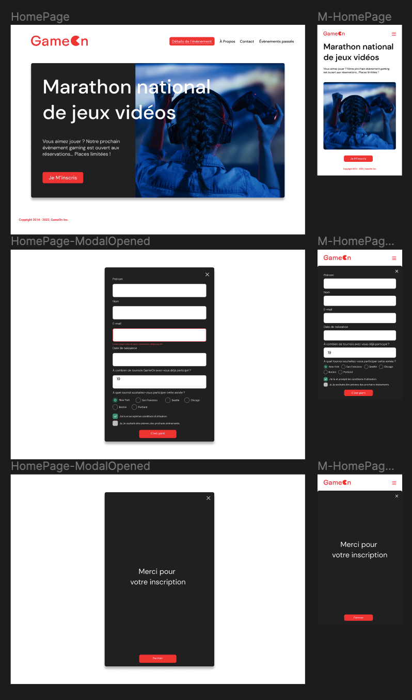

# Projet GameOn

Projet n°4 du parcours javascript-React chez OpenClassrooms. L'objectif est de poursuivre un projet de création d’un formulaire d’inscription à des concours de jeux vidéos (voir les [maquettes Figma](https://www.figma.com/file/B7NKBDvSI18uoMLJgpnh48/UI-Design-GameOn-FR?node-id=106%3A630) ).

### Spécifications techniques du projet

- Langages utilisés : HTML, CSS et Javascript

- Validation au W3C

- Compatible avec Chrome et Firefox

- Desktop first puis s’adapte au format responsive